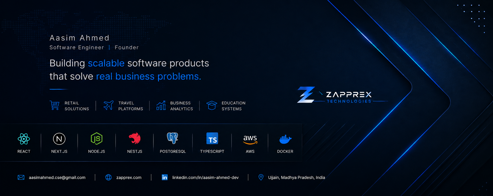

  

 

<h1 align="center">Hi, I'm Aasim Ahmed 👋</h1>

I'm a **Software Engineer** and **Founder of Zapprex Technologies**, passionate about building production-ready Full Stack applications that solve real business problems.

I specialize in designing scalable web applications using **React, Node.js, Express.js, NestJS, PostgreSQL, and TypeScript**, with a strong focus on clean architecture, backend development, and modern user experiences.

Currently, I'm focused on strengthening my software engineering skills, building impactful projects, and preparing for Full Stack and Backend Software Engineer opportunities at product companies, startups, and remote teams.
---

## 🚀 Current Focus

- Building production-ready Full Stack applications
- Backend architecture with Node.js & NestJS
- Scalable REST APIs and PostgreSQL
- System Design and Software Engineering
- Preparing for Software Engineer opportunities

---

# 🏆 Professional Highlights

- 🚀 **Founder & Software Engineer** at **Zapprex Technologies**, building scalable web applications and digital products.

- 🛒 Developed **NazMart**, a production-ready Point of Sale (POS) platform featuring barcode billing, inventory management, thermal printing, and PostgreSQL-powered backend services.

- ✈️ Architected **TravellTech**, a modern SaaS travel management platform with role-based access control, booking workflows, and scalable cloud infrastructure.

- 📊 Built a **Business Intelligence Dashboard** for retail businesses with real-time analytics, reporting, inventory insights, and performance monitoring.

- 🎓 Engineered an **Academic Workflow Management System** that digitizes student verification, assignment tracking, and no-dues approval workflows across multiple user roles.

- ⚙️ Experienced in designing scalable REST APIs, backend architectures, authentication systems, and database-driven applications using modern software engineering practices.

- ☁️ Built and deployed full-stack applications using **AWS**, **Docker**, **Render**, **Vercel**, **PostgreSQL**, **MongoDB Atlas**, and **Cloudinary**.

- 🎯 Currently seeking **Software Engineer**, **Backend Engineer**, and **Full Stack Developer** opportunities in product companies, startups, and remote teams.

---

# 💡 Engineering Philosophy

I enjoy building software that solves real business problems through clean architecture, scalable backend systems, and intuitive user experiences.

I believe great software is not just about writing code—it's about understanding users, simplifying workflows, and delivering reliable products that create real value.

---

# 💡 What I Build

I enjoy designing and building software that solves real-world business problems through scalable architectures, modern user experiences, and production-ready backend systems.

My work spans multiple industries including **Retail Technology**, **Travel Technology**, **Business Intelligence**, and **Education Technology**, with a strong focus on delivering reliable applications that improve operational efficiency and user experience.

---

# 🚀 Production Projects

## 🏪 Retail Technology

### 🛒 NazMart — Production Point of Sale (POS)

A production-ready retail platform that modernizes billing, inventory management, barcode scanning, and thermal receipt printing for modern retail businesses.

#### ✨ Highlights

- Barcode-powered billing workflow
- Inventory & product management
- Bill editing & reprinting
- Bluetooth & Browser thermal printing
- Progressive Web App (PWA)
- Responsive user interface

#### 🛠 Engineering Stack

`React` `Vite` `Tailwind CSS`
`Node.js` `Express.js`
`PostgreSQL`
`Capacitor`

#### 🌍 Live Project

https://www.nazmart.store

---

## 🌍 Travel Technology

### ✈️ TravellTech — Smart Travel Management Platform

A commercial SaaS platform developed for travel agencies to manage bookings, tour packages, customer inquiries, payments, and business operations through a secure cloud-native architecture.

#### ✨ Highlights

- Multi-role authentication (RBAC)
- Tour package management
- Booking workflow
- Payment integration
- SEO-optimized architecture
- Cloud-native deployment
- Modern responsive interface

#### 🛠 Engineering Stack

`Next.js`
`React`
`TypeScript`
`NestJS`
`PostgreSQL`
`Prisma`
`Docker`
`AWS`

#### 🌍 Live Project

https://travelltech.com

---

## 📈 Business Intelligence

### 📊 Shop Analytics Dashboard

A Business Intelligence platform that helps retailers monitor sales, inventory, expenses, and overall business performance through real-time analytics and interactive dashboards.

#### ✨ Highlights

- Business analytics dashboard
- Sales & revenue reporting
- Inventory insights
- Interactive charts
- Desktop application support

#### 🛠 Engineering Stack

`React`
`TypeScript`
`Node.js`
`PostgreSQL`
`Drizzle ORM`
`Electron`

---

## 🎓 Education Technology

### 🎓 Academic Workflow Management System

A full-stack academic workflow platform that digitizes assignment verification, project approvals, and examination no-dues management across multiple departments.

#### ✨ Highlights

- Student, Faculty & HOD portals
- Assignment verification
- Lab manual tracking
- Major & Minor project workflow
- Digital no-dues approval
- Real-time submission tracking

#### 🛠 Engineering Stack

`React`
`Node.js`
`Express.js`
`MongoDB`
`Tailwind CSS`

#### 🌍 Live Project

https://no-dues-management-system-yomh.vercel.app/

---

# 🛠 Engineering Stack

<table>
<tr>
<td valign="top" width="25%">

### 🎨 Frontend

- React
- Next.js
- TypeScript
- JavaScript (ES6+)
- Tailwind CSS
- Vite
- shadcn/ui

</td>

<td valign="top" width="25%">

### ⚙️ Backend

- Node.js
- Express.js
- NestJS
- REST APIs
- Authentication
- RBAC

</td>

<td valign="top" width="25%">

### 🗄 Database

- PostgreSQL
- MongoDB
- Prisma ORM
- Drizzle ORM
- Mongoose
- Redis

</td>

<td valign="top" width="25%">

### ☁ Cloud & DevOps

- AWS
- Docker
- GitHub Actions
- Render
- Vercel
- Cloudinary

</td>
</tr>
</table>

---

## 💻 Development Tools

`Git` • `GitHub` • `Postman` • `VS Code` • `Figma` • `Linux` • `npm`

---
# 🧠 Core Engineering Principles

When building software, I focus on:

- Designing scalable and maintainable architectures
- Writing clean, readable, and reusable code
- Building secure backend systems with proper authentication and authorization
- Creating intuitive user experiences without sacrificing performance
- Developing solutions that solve real business problems
- Continuously learning modern software engineering practices
# 📚 Currently Learning

- System Design
- Distributed Systems
- Advanced PostgreSQL
- Docker & Kubernetes
- AWS Cloud Services
- Software Architecture
---

# 📈 GitHub Analytics

  
  

  

---

# 🤝 Let's Connect

I'm always open to discussing software engineering, backend architecture, scalable web applications, startup ideas, and exciting opportunities.

---

### ⭐ Thanks for visiting my profile!

*"Building software isn't just about writing code — it's about solving real problems through technology."*

# 📌 Career Objective

I'm currently seeking **Software Engineer**, **Backend Engineer**, and **Full Stack Developer** opportunities where I can contribute to building scalable products, solve real business problems, and continue growing as an engineer.

I'm particularly interested in product companies, high-growth startups, and remote engineering teams that value clean architecture, collaboration, and continuous learning.